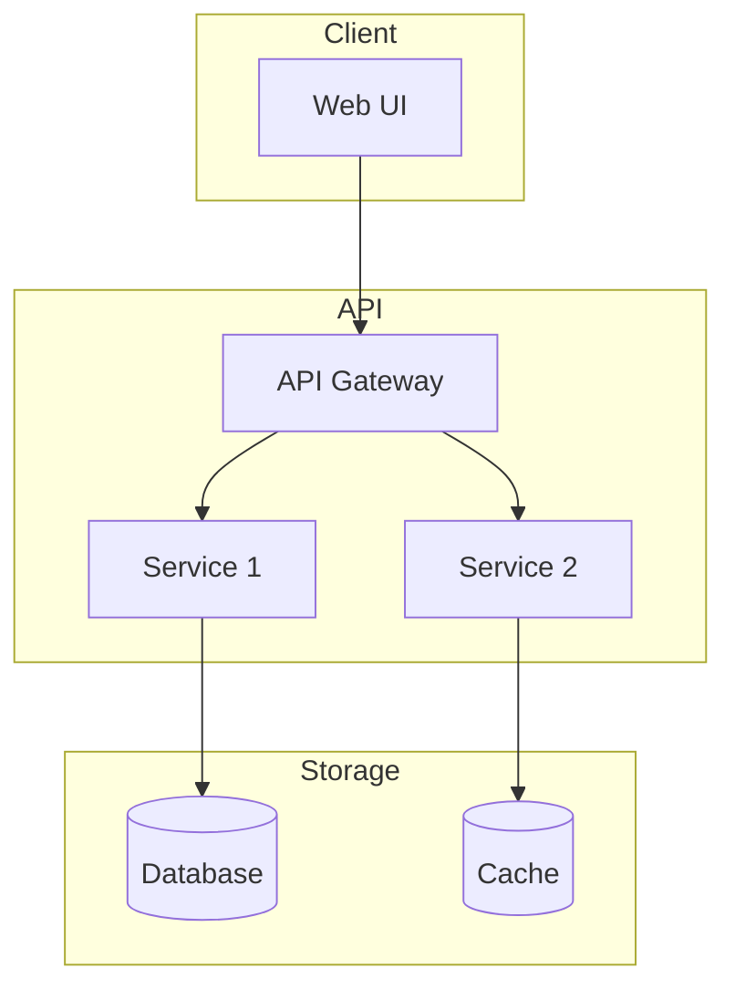
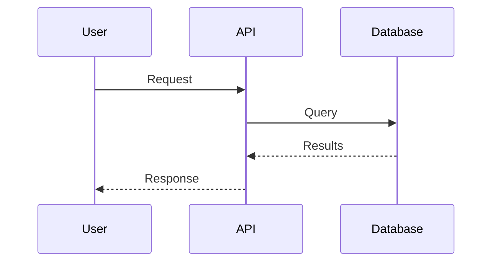
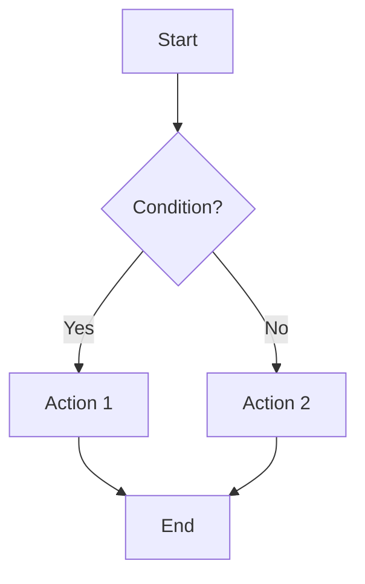

# Documentation Generation

Professional documentation with API specs, diagrams, and architecture records.

## When to Activate
- User says "document this" or "generate docs"
- Major feature complete
- API endpoint created
- Architecture decision made

## README Generation

### Pattern
```markdown
# [Project Name]

[One-line description]

## Features
- ✅ [Feature 1]
- ✅ [Feature 2]
- ✅ [Feature 3]

## Quick Start

### Prerequisites
- Node.js 18+
- [Other requirements]

### Installation
```bash
git clone [repo]
cd [project]
npm install
```

### Configuration
```bash
cp .env.example .env
# Edit .env with your values
```

### Running
```bash
npm run dev      # Development
npm run build    # Production build
npm run test     # Run tests
```

## Architecture
[Brief architecture overview]

## API Reference
[Link to API docs or inline summary]

## Contributing
[Contribution guidelines]

## License
[License type]
```

## API Documentation

### OpenAPI/Swagger Pattern
```yaml
openapi: 3.0.0
info:
  title: [API Name]
  version: 1.0.0
  description: [API description]

servers:
  - url: https://api.example.com
    description: Production
  - url: http://localhost:3000
    description: Development

paths:
  /api/[endpoint]:
    get:
      summary: [Short description]
      description: [Detailed description]
      parameters:
        - name: [param]
          in: query
          required: false
          schema:
            type: string
      responses:
        '200':
          description: Success
          content:
            application/json:
              schema:
                $ref: '#/components/schemas/[ResponseType]'
        '400':
          description: Bad request
        '401':
          description: Unauthorized

components:
  schemas:
    [ResponseType]:
      type: object
      properties:
        id:
          type: string
        data:
          type: object
```

### Inline API Doc
```typescript
/**
 * [Function description]
 * 
 * @param {string} param1 - [Description]
 * @param {Object} options - [Description]
 * @param {boolean} options.flag - [Description]
 * @returns {Promise<Result>} [Description]
 * @throws {AppError} [When/why it throws]
 * 
 * @example
 * const result = await myFunction('input', { flag: true });
 * console.log(result); // { success: true }
 */
export async function myFunction(param1: string, options: Options): Promise<Result> {
  // Implementation
}
```

## Architecture Decision Records (ADR)

### Pattern
```markdown
# ADR-[number]: [Title]

## Status
[Proposed | Accepted | Deprecated | Superseded by ADR-X]

## Context
[What is the issue that we're seeing that is motivating this decision?]

## Decision
[What is the change that we're proposing and/or doing?]

## Consequences
### Positive
- [Consequence 1]
- [Consequence 2]

### Negative
- [Tradeoff 1]
- [Tradeoff 2]

### Neutral
- [Side effect]

## Alternatives Considered
1. [Alternative 1] - Rejected because [reason]
2. [Alternative 2] - Rejected because [reason]
```

## Mermaid Diagrams

### Architecture Diagram


### Sequence Diagram


### Flow Diagram


## CHANGELOG Generation

### Pattern
```markdown
# Changelog

All notable changes to this project will be documented in this file.

## [Unreleased]

### Added
- [Feature description]

### Changed
- [Change description]

### Fixed
- [Bug fix description]

---

## [1.0.0] - YYYY-MM-DD

### Added
- Initial release
- [Feature 1]
- [Feature 2]
```

## Documentation Checklist

When documenting, ensure:
- [ ] README is up to date
- [ ] API endpoints documented
- [ ] Environment variables listed
- [ ] Architecture decisions recorded
- [ ] Setup instructions tested
- [ ] Examples provided
- [ ] Diagrams for complex flows
